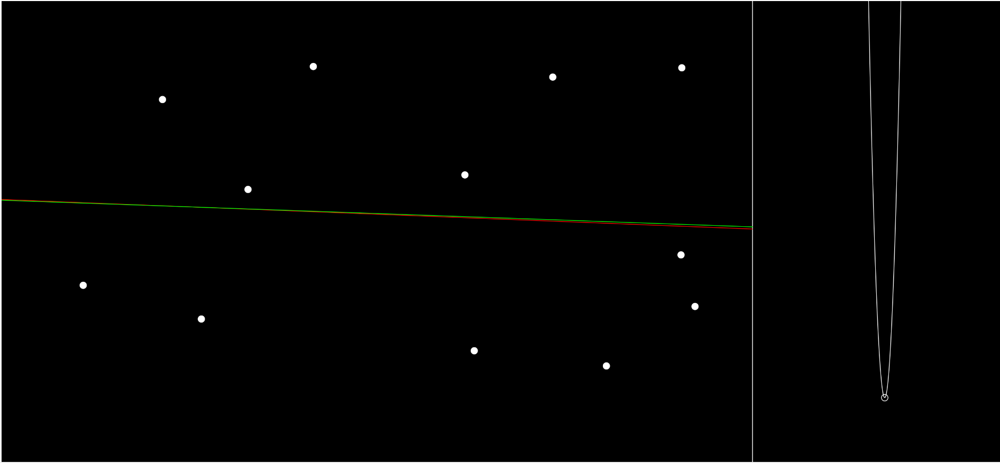

# LinearRegression_GradientDescent
Linear Regression using Gradient Descent with cost function

- The **red** line is obtained by the general linear regression equation.
- The **green** line is obtained by the Gradient Descent Equation.
- The graph on right is the cost function.
